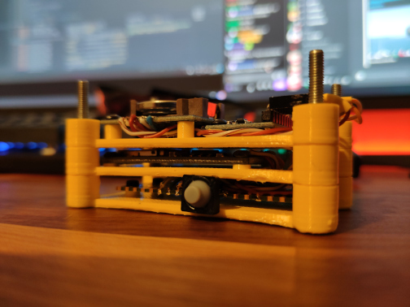

# Gyrologger

This is a small project mainly built to be used with Gyroflow for video stabilisation. It can log at 1khz using the MPU6050 and 2-3khz using MPU6500 on SPI.The size of my built one is not something I'm proud of considering that it doesn't even have its own power source. Yes, that RTC is huge, it's the only one I had lying around and I wanted the name of the files as a date so I know which is which 😂.
(I will probably go with a custom pcb in the end but since LCSC doesn't have any MPU6500 in stock that is on hold...)

## Parts
- Raspberry Pi Pico
- MPU6050/MPU6500 (i2c/spi)
- DS1307
- MicroSD Breakout Module

## Pinout
MPU6500:
- MPU_PIN_MISO -> 12
- MPU_PIN_CS -> 13
- MPU_PIN_SCK -> 10
- MPU_PIN_MOSI -> 11

<!-- -->
MPU6050:
- MPU_PIN_SDA -> 14
- MPU_PIN_SCL -> 15

<!-- -->
DS1307:
- RTC_PIN_SDA -> 20
- RTC_PIN_SCL -> 21

<!-- -->
Button:
- Pin 26

# Disclaimer
This is very much a work in progress thing and can change drastically.
